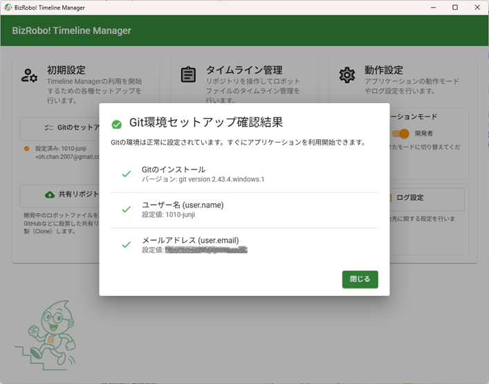
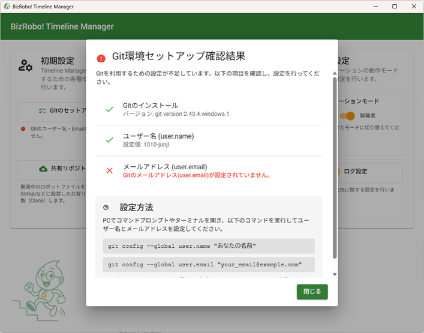
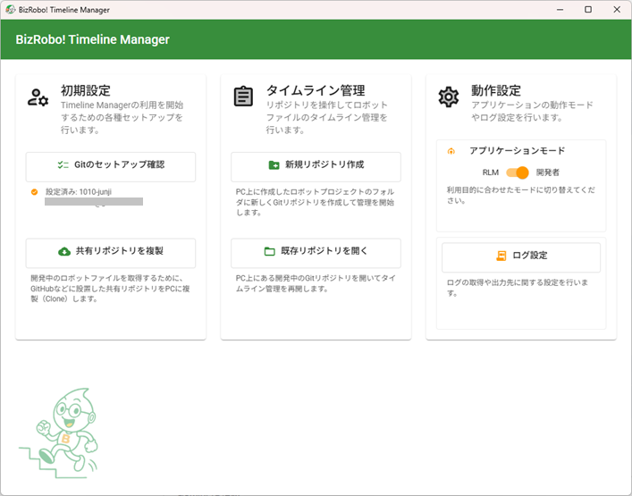
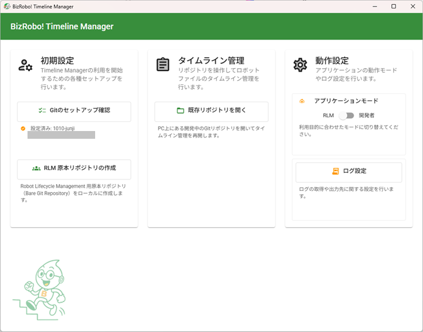
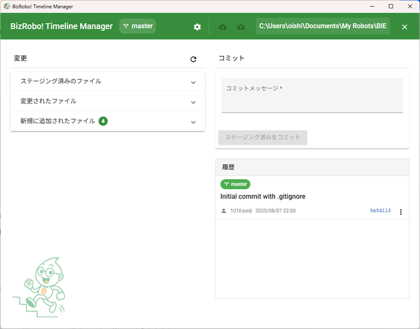
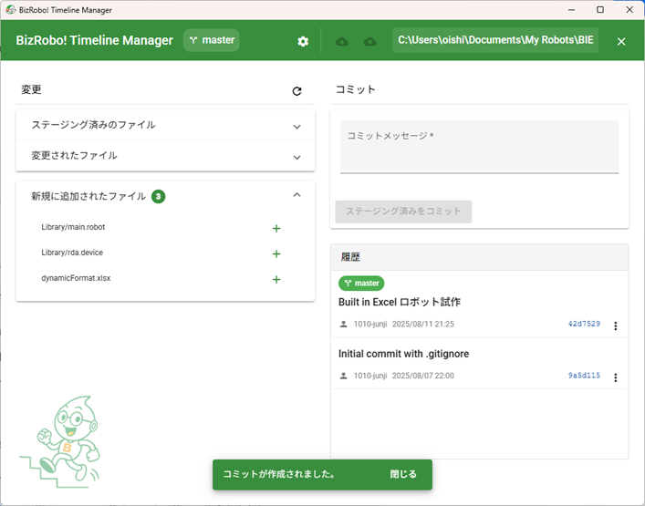
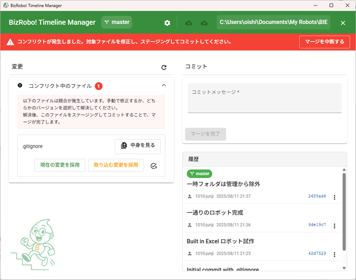
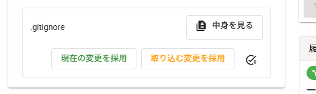

### BizRobo! Timeline Manager 利用ガイド

このガイドは、「BizRobo! Timeline Manager」の基本的な使い方から便利な機能までを解説するユーザーマニュアルです。

### 1. はじめに

BizRobo! Timeline Manager は、BizRobo!のロボット（`.robot`）やタイプ（`.type`）ファイルの **「いつ」「誰が」「何を」変更したのかを記録・管理するためのツール** です。Git の難しいコマンドを覚える必要はなく、画面のボタンをクリックするだけで、安全にバージョン管理（タイムライン管理）を行えます。

#### **2 つの利用者層をサポート**

このツールは、主に 2 つの役割を持つ方々を対象としています。

1.  **BizRobo! 開発者 (シチズンデベロッパー)**

    - 「昔のバージョンのロボットに戻したい...」
    - 「他の人がどこを変更したのか知りたい...」
    - 「手動でのバックアップ管理が大変...」

    といったお悩みを解決し、日々のロボット開発をサポートします。

2.  **プロモーションマネージャー（Robot Lifecycle Management 管理者）**

    - GitHub のような外部サービスを使わず、社内のファイルサーバーで小規模な RLM（Robot Lifecycle Management）を実現したい。

    といった要望に応え、安全な開発基盤の構築を支援します。

このガイドでは、それぞれの役割に応じた使い方を解説していきます。

---

### 2. 初回起動と共通セットアップ

アプリケーションを初めて起動すると、ウェルカム画面が表示されます。まず、利用を開始するためにいくつかの初期設定を行いましょう。

#### **Step 1: Git 環境のチェック**

本ツールは、内部で「Git」というバージョン管理システムを利用しています。そのため、コミット（変更の記録）を行う「あなた」が誰なのかを Git に教える必要があります。

1.  ウェルカム画面の `[初期設定]` カードにある **[Git のセットアップ確認]** ボタンをクリックします。
2.  ダイアログが表示され、チェック結果を確認できます。

    - **緑のチェックで「設定済み」と表示される場合:**
      

      準備は万端です！ すぐにツールの利用を開始できます。

    - **赤のエラーで「設定されていません」と表示される場合:**
      

      ユーザー名やメールアドレスが未設定の状態です。このままでは誰が変更を記録したか分からなくなってしまうため、設定が必要です。
      PC の「コマンドプロンプト」または「ターミナル」を開き、ダイアログに表示されている以下のコマンドをコピー＆ペーストして実行してください。
      （`"あなたの名前"` と `your_email@example.com` はご自身のものに置き換えてください）

      ```bash
      git config --global user.name "あなたの名前"
      git config --global user.email "your_email@example.com"
      ```

      設定後、再度 **[Git のセットアップ確認]** ボタンを押し、すべての項目が緑のチェックに変わることを確認してください。

#### **Step 2: アプリケーションモードの選択**

本ツールには、利用目的別に 2 つの動作モードがあります。 `[動作設定]` カードのスライドトグルで切り替えられます。

- **開発者 (Developer) モード (デフォルト)**
  

  ご自身の PC でロボットを開発・編集する方向けのモードです。ロボットの編集、変更の記録、チームとの共有など、すべての機能を利用できます。**ほとんどのユーザーはこちらのモードを使用します。**

- **RLM (Robot Lifecycle Management) モード**
  

  チーム開発の原本（マスターデータ）となる特別な保管庫（リポジトリ）を作成・管理するシステム管理者向けの、機能が限定されたモードです。

---

### 3. 【開発者向け】日々のロボット開発での使い方 (Developer Mode)

この章では、「開発者モード」を利用して、日々のロボット開発におけるバージョン管理を行う方法を解説します。
まずは一人で使う簡単な流れから始め、次にチームで共同作業する方法へとステップアップしていきましょう。

#### **A) まずは一人で使ってみる：個人のロボット開発**

自分の PC にあるロボットプロジェクトの変更履歴を記録していく、最も基本的な使い方です。

**Step 1: 保管庫（リポジトリ）の準備**

最初に一度だけ、ロボットファイルを保管するための「保管庫（リポジトリ）」を準備します。

1.  ウェルカム画面の `[タイムライン管理]` カードにある **[新規リポジトリ作成]** ボタンをクリックします。
2.  フォルダ選択ダイアログが表示されたら、管理したい BizRobo!プロジェクトのフォルダ（例: `C:\BizRobo\Projects\MyProject`）を選択します。
3.  これだけで準備は完了です。自動的にリポジトリが開かれ、メインの管理画面に切り替わります。

**Step 2: 日々の作業（編集 → 記録）**

ロボットを編集した後に、その変更を記録する一連の流れです。



1.  **変更の検知**

    - Design Studio などでロボットファイル（`.robot`）やタイプファイル（`.type`）を編集・保存します。
    - すると、アプリが自動で変更を検知し、画面左側の `[変更されたファイル]` や `[新規に追加されたファイル]` リストに、該当するファイル名が表示されます。

2.  **ステージング (Staging)：記録する変更を選ぶ**

    - 今回はこの変更を記録に残したい、というファイルを選び出す作業です。
    - `[変更されたファイル]` リストにある、記録したいファイルの右側の **[+]** アイコン（ステージングする）をクリックします。
    - クリックされたファイルは、その上の `[ステージング済みのファイル]` エリアに移動します。これにより、「この変更を記録しますよ」という意思表示になります。
      ![スクリーンショット: ファイルをステージングして、[ステージング済みのファイル]エリアに移動した様子](images/repo-stging.png)

3.  **コミット (Commit)：変更にメモを付けて記録する**
    - ステージングした変更内容に、後から見返しても分かるような「変更メモ」を付けて、保管庫に正式に記録します。この操作を「コミット」と呼びます。
    - 画面右側の `[コミット]` エリアにある **[コミットメッセージ]** の欄に、**何を変更したのか**が簡潔に分かるメモを入力します。（例: 「品番検索機能の不具合を修正」「新しいエラー処理を追加」など）
    - メッセージを入力したら、その下にある **[ステージング済みをコミット]** ボタンをクリックします。
    - コミットが成功すると、`[履歴]` リストの先頭に今記録した内容が追加され、`[変更]` エリアのファイルリストは空になります。
      

これで、一つの変更作業の記録が完了しました。この「**編集 → ステージング → コミット**」のサイクルを繰り返すことで、ロボットのバージョンがタイムラインとして積み上がっていきます。

#### **B) チームで共同作業する：共有リポジトリでの開発**

チームで開発する場合、管理者が用意した「共有リポジトリ」を使って、お互いの変更内容をやり取りします。

**Step 1: 共有リポジトリから自分の作業場を準備（Clone）**

チーム開発に参加する最初のステップです。共有リポジトリを自分の PC に複製（クローン）します。

1.  ウェルカム画面の `[初期設定]` カードにある **[共有リポジトリを複製]** ボタンをクリックします。
2.  ダイアログが表示されたら、管理者から共有された「共有リポジトリの URL」と、自分の PC で作業フォルダを置きたい「PC 上の保存先フォルダ」を指定します。
3.  **[複製 (Clone)]** ボタンを押すと、指定した保存先フォルダの中に、共有リポジトリと同じ名前のフォルダ（あなたの作業場）が作成され、自動的に開かれます。

**Step 2: 日々の作業サイクル**

チーム開発では、自分の作業と他の人の作業をスムーズに統合していくことが重要です。

1.  **変更を取り込む (Pull)**

    - 作業を始める前に、まずツールバー右上の **[↓]** (クラウドダウンロード) アイコンをクリックします。
    - これにより、共有リポジトリにある他のメンバーの最新の変更が、あなたの PC の作業場に反映されます。この操作を「プル」と呼びます。

2.  **自分の変更を編集・記録する (ステージング & コミット)**

    - ロボットを編集し、変更を加えます。
    - 変更が終わったら、前述の「A) まずは一人で使ってみる」の **Step 2** と同じ手順で、「**ステージング → コミット**」を行い、自分の変更をローカルの保管庫に記録します。

3.  **変更を共有する (Push)**
    - 自分の PC でコミットしただけでは、その変更はまだチームメンバーには見えません。
    - ツールバー右上の **[↑]** (クラウドアップロード) アイコンをクリックします。
    - これにより、あなたがコミットした変更が共有リポジトリへ送信され、チーム全体に共有されます。この操作を「プッシュ」と呼びます。

この「**Pull → 編集 → Commit → Push**」が、チーム開発での基本的なサイクルになります。

#### **便利な機能：開発をもっと快適に**

- **ブランチ：作業を安全に分岐させる**
  「メインの安定版ロボットはそのままに、新しい機能を並行して試したい」といった場合に「ブランチ（分岐）」が役立ちます。

  - **作成と切替**: ツールバー中央のブランチ名が表示されている部分（例: `main`）をクリックするとメニューが開きます。ここで新しいブランチを作ったり、作業したいブランチに切り替えたりできます。
  - **マージ（合流）**: 新機能用のブランチでの作業が完了したら、ブランチメニューの **[call_merge]** アイコンをクリックして、変更内容をメインのブランチに安全に合流させることができます。

- **過去の作業に戻す・確認する**
  - **変更の取り消し (Revert)**: `[履歴]` リストの各コミットの右側にある **[…]** メニューから **[この変更を取り消す (Revert)]** を選択すると、そのコミットの変更内容を"打ち消す"新しいコミットが作成されます。元の履歴を消さずに安全に変更を元に戻せます。
  - **タグ付け**: 「バージョン 1.0 完成」など、開発の節目となる重要なコミットの **[…]** メニューから **[タグを作成...]** を選択すると、その履歴に`v1.0`のような分かりやすい「目印（タグ）」を付けることができます。

---

### 4. 【管理者向け】チーム開発の原本管理での使い方 (RLM Mode)

この章では、システム管理者の方が「RLM モード」を利用して、チームで開発するロボットファイルの **原本（マスターデータ）** を安全に一元管理する方法を解説します。

#### **RLM モードの目的**

GitHub のような外部のクラウドサービスを利用せずに、**社内のファイルサーバー上**に、チーム開発の中心となる「**共有リポジトリ（Bare Repository）**」を設置し、管理することがこのモードの主な目的です。

この共有リポジトリは、開発者たちが直接ファイルを編集する場所ではなく、変更履歴だけを格納する**金庫**のような役割を果たします。開発者たちはこの金庫からロボットの最新版を複製（Clone）してきて自分の PC で作業し、完成した変更内容を再び金庫に戻す（Push）という流れで共同作業を行います。

#### **Step 1: アプリケーションモードの切り替え**

まず、管理者として作業を行うために、アプリケーションを RLM モードに切り替えます。

1.  ウェルカム画面の `[動作設定]` カードを見つけます。
2.  `[アプリケーションモード]` のスライドトグルをクリックして **OFF** にし、左側の「RLM」が選択された状態にします。

    

RLM モードに切り替えると、管理者向けの機能に絞られたシンプルなメニュー表示に変わります。

#### **Step 2: 共有リポジトリ（原本）の作成**

次に、チーム開発の核となる共有リポジトリを作成します。この作業は、リポジトリを設置したいファイルサーバー上のフォルダに対して行います。

1.  `[初期設定]` カードにある **[RLM 原本リポジトリの作成]** ボタンをクリックします。
2.  フォルダ選択ダイアログが表示されます。ここで、ファイルサーバー上の**空のフォルダ**を選択します。
    - 例: `\\fileserver\BizRobo\SharedRepo\ProjectA`
    - **注意:** このフォルダは、開発者全員が読み書きできる共有フォルダである必要があります。
3.  選択すると、指定したフォルダ内に共有リポジトリ（Bare Repository）が作成されます。完了メッセージが表示されれば成功です。

この操作により、指定されたフォルダは、変更履歴を格納するための特別な「金庫」としてセットアップされました。

#### **Step 3: 開発者への情報共有**

共有リポジトリを作成したら、開発者（BizRobo! Timeline Manager を開発者モードで使うユーザー）に、そのリポジトリの場所を伝える必要があります。

開発者には、以下の情報を共有してください。

- **共有リポジトリのパス（URL）**:
  - 先ほど作成した共有リポジトリのフォルダパスです。
  - 例: `\\fileserver\BizRobo\SharedRepo\ProjectA`

開発者は、このパスを使って「**3. B) チームで共同作業する**」の **Step 1** に記載されている **「共有リポジトリを複製（Clone）」** の操作を行うことで、チーム開発に参加できるようになります。

#### **管理者の役割**

基本的に、共有リポジトリは一度作成すれば、後は自動的に開発者からの変更履歴（Push）を受け付け、蓄積していきます。管理者が日常的に操作を行う必要はほとんどありません。

主な役割は以下の通りです。

- **初期セットアップ**: 上記の手順に沿って、プロジェクトごとに共有リポジトリを作成します。
- **アクセス権の管理**: ファイルサーバーの機能を使って、共有リポジトリフォルダへのアクセス権を適切に管理します。
- **バックアップ**: 共有リポジトリのフォルダ全体を定期的にバックアップすることで、万が一の事態に備えます。
- **トラブルシューティング**: 高度な問題が発生した場合、後述の「CLI クライアント」機能を使ってリポジトリの状態を確認・修正することがあります。

---

### 5. 困ったときには (共通ガイド)

この章では、ツールの利用中に発生する可能性のある問題への対処法や、さらに便利な機能について解説します。

#### **コンフリクト（競合）への対処法**

チーム開発において、**「あなた」と「他の誰か」が、同じファイルの同じ箇所を別々に編集してしまった**場合に「コンフリクト（競合）」が発生します。これはエラーではなく、「どちらの変更を正とすべきか、人が判断する必要がある」というサインです。

コンフリクトは、他の人の変更を取り込む「Pull」や、ブランチを合流させる「Merge」の際に発生する可能性があります。

**Step 1: コンフリクトの発生を把握する**



1.  コンフリクトが発生すると、画面上部に**赤い警告バー**が表示されます。
2.  対象となったファイルは、`[変更]` エリアの最上部にある `[コンフリクト中のファイル]` リストに表示されます。

**Step 2: コンフリクトを解決する**

`[コンフリクト中のファイル]` リストに表示された各ファイルについて、どの変更内容を採用するかを決定します。解決方法は主に 2 つあります。

- **A) ボタン一つで簡単解決（どちらか一方の変更を完全に採用する場合）**

  もし、自分か相手の変更どちらか一方を「正」として採用するだけでよければ、ボタン操作で簡単に解決できます。

  

  - **[現在の変更を採用] ボタン**: **あなたの**変更内容で、相手の変更を上書きします。
  - **[取り込む変更を採用] ボタン**: **相手の**変更内容で、あなたの変更を上書きします。

  どちらかのボタンを押すと、ファイルは自動的に修正され、解決済み（ステージング済み）の状態になります。

- **B) 手動でじっくり解決（両方の変更内容をうまく組み合わせたい場合）**

  「相手の変更の良い部分と、自分の変更の良い部分を両方残したい」といった場合は、手動でファイルを編集して解決します。

  1.  まず **[中身を見る]** ボタンをクリックして、どのようにコンフリクトしているかを確認します。
      `<<<<<<< HEAD` から `=======` までがあなたの変更（現在の変更）、`=======` から `>>>>>>> ...` までが相手の変更（取り込む変更）です。
  2.  Design Studio ではコンフリクト状態となったファイルは開くことができませんので、ファイルの中身を見て変更点などが判断できない場合には、安全を期して **[現在の変更を採用]** をクリックして自分が編集した状態を保ったうえで別途取込元のロボットファイルなどを取得して Design Studio で比較することをお勧めします。
  3.  ファイル内に自動で挿入されている `<<<<<<<`, `=======`, `>>>>>>>` といったマーカー（目印）ごと、不要な部分を削除し、両者の良いとこ取りをするなどして、ファイルを最終的にあるべき正しい状態に修正し、**上書き保存**します。
  4.  ファイルの修正が終わったら、Timeline Manager の画面に戻り、コンフリクトリストにあるファイルの右側の **[add_task]** アイコン（手動で修正完了したのでステージングする）をクリックします。これで「解決済み」として扱われます。

**Step 3: 解決の完了を記録する**

1.  `[コンフリクト中のファイル]` リストにある**すべてのファイル**に対して、Step 2 の解決作業を行います。
2.  すべてのファイルが解決され、`[ステージング済みのファイル]` エリアに移動したことを確認します。
3.  最後に、`[コミット]` エリアのボタンが **[マージを完了]**（または[変更の取り消しを完了]）に変わっているので、このボタンをクリックします。コミットメッセージは自動で入力されるため、変更は不要です。

これでコンフリクトの解決処理はすべて完了です。

#### **その他の便利な機能**

- **管理対象からファイルを除外する (.gitignore)**
  BizRobo!プロジェクトフォルダの中には、バックアップファイル（例: `MyRobot.robot.~`）など、バージョン管理する必要のないファイルが自動で生成されることがあります。これらを管理対象から恒久的に除外することができます。

  1.  ツールバー右上の **[⚙]** (歯車) アイコンをクリックし、メニューから **[除外ファイルの指定 (.gitignore)]** を選択します。
  2.  ダイアログが開くので、除外したいファイルやフォルダのパターンを一行ずつ入力します。
      - 例 1: `*.~` （末尾が `.~` で終わるすべてのファイルを除外）
      - 例 2: `temp/` （temp フォルダの中身をすべて除外）
  3.  **[保存]** をクリックすると設定が反映され、以降は指定したファイルが変更リストに表示されなくなります。

- **管理者向け CLI クライアント**
  （主に管理者向け）GUI にない高度な Git 操作が必要な場合、コマンドを直接実行できる画面を利用できます。

  - ツールバーの **[⚙]** メニューから **[CLI クライアント (管理者向け)]** を選択すると、専用のダイアログが開きます。

- **ログの確認**
  アプリケーションの動作に問題があった場合、原因調査の手がかりとして操作ログが記録されています。
  - ウェルカム画面の `[動作設定]` カードにある **[ログ設定]** ボタンをクリックします。
  - 開いたダイアログで **[ログフォルダを開く]** ボタンを押すと、ログファイルが保存されているフォルダを直接開くことができます。
